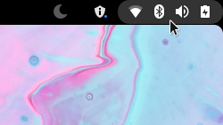

# fluoroom-gnome-top-bar
Persistent top bar based on Gnome's default style, with some modifications.

This extension makes black background and screen corners persistent and makes buttons round, but it will respect your current theme's fonts, margins and icons.

https://extensions.gnome.org/extension/4350/fluorooms-top-bar/

